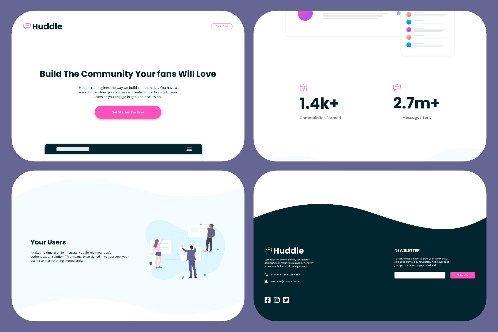

# Huddle landing page with curved sections

This is a solution to the [Huddle landing page with curved sections challenge on Frontend Mentor](https://www.frontendmentor.io/challenges/huddle-landing-page-with-curved-sections-5ca5ecd01e82137ec91a50f2).

### The challenge

Users should be able to:

- View the optimal layout for the site depending on their device's screen size
- See hover states for all interactive elements on the page

### Screenshot




### Links

- Solution URL: [Add solution URL here](https://your-solution-url.com)
- Live Site URL: [Add live site URL here](https://your-live-site-url.com)

## My process

### Built with

- [React](https://reactjs.org/) - JS library
- [Styled Components](https://styled-components.com/) - For styles
- [Font Awesome React component](https://fontawesome.com/v5/docs/web/use-with/react) - For icons
- [React Helmet](https://github.com/nfl/react-helmet#readme) -For meta tags
- [Firefox Browser Developer Edition](https://www.mozilla.org/en-US/firefox/developer/) -For its awesome Responsive Design Mode
- Desktop-first workflow

### What I learned

- learnt and got proficient in styled components
- globalStyles, ThemeProvider
- Creating custom utility styled components

```js
// my custom component for wave SVGs
<WaveStyled
  src={`./images/bg-footer-top-${width <= 768 ? "mobile" : "desktop"}.svg`}
  position="top"
/>
```

- Got better in working with react(props, state, useEffects)
- Working with fontawesome in react
- Passing meta tags with react-helmet
- Dynamically rendering device specific components using windows.innerwidth.
- CSS lazy loading


### Continued development

- Need to focus more on clean code and folder structure
- Web performance
- SEO optimisations

### Useful resources

- [White gap between SVG and div](https://stackoverflow.com/questions/64600824/white-gap-between-svg-and-div/64611175#64611175) - This is a life saver when your working with wave sections.
- [Styled Components Crash Course & Project](https://youtu.be/02zO0hZmwnw) by Traversy Media. It's reason I started this project.Since he used this challege to teach styled components.
- [IconScout](https://iconscout.com/icon-editor) - This helped me to change the colors of SVG assets quickly.
- [Svg Crop](https://svgcrop.com/) - This is an amazing tool helped to to crop SVGs assets instantly without any manual work.
- [How to Add Font Awesome Icons in React JS](https://youtu.be/L4CK3j72SfM) - Another life saver. I struggled a lot to with fontawesome documentation to add [Font Awesome React component](https://fontawesome.com/v5/docs/web/use-with/react)

## Author

- Twitter - [@ItsKiranMp](https://twitter.com/ItsKiranMp)
- LinkedIn - [@kiran-m-p](https://www.linkedin.com/in/kiran-m-p/)
- Instagram - [@itskiranmp](https://www.instagram.com/itskiranmp/)
- Frontend Mentor - [@Kiran-M-P](https://www.frontendmentor.io/profile/Kiran-M-P)
